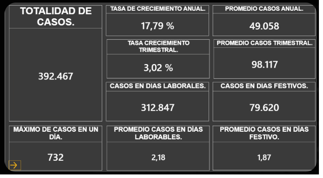
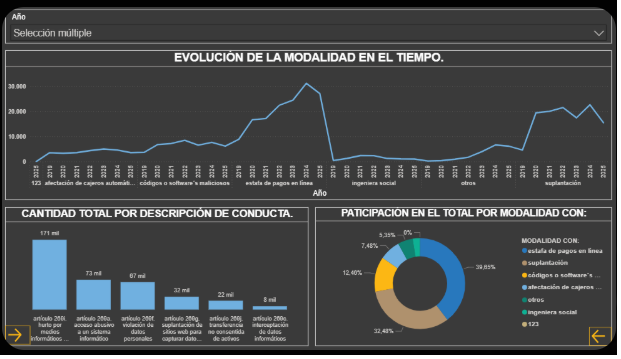
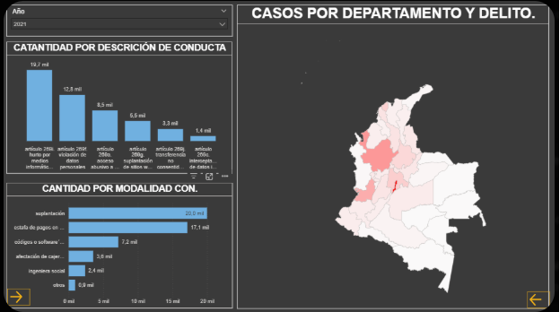
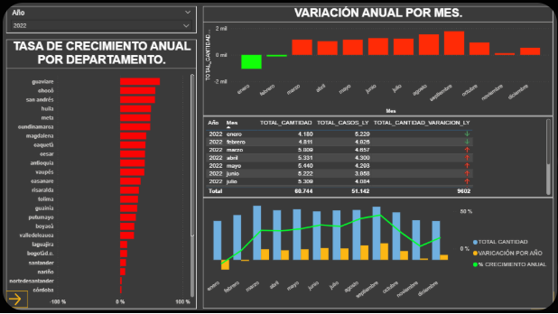
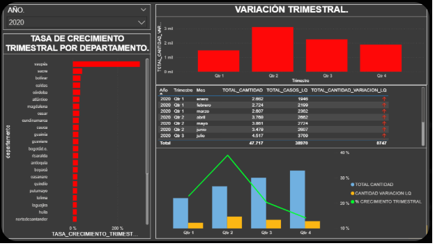

CYBER-RISK INTELLIGENCE: SCORING DE RIESGO Y DETECCIÓN PREDICTIVA
Autor: Julián Esteban León Ospina

Descripción del Proyecto
Este ecosistema analítico está diseñado para identificar, clasificar y predecir riesgos operativos en el sector 
financiero colombiano, enfocándose en la transición de delitos tradicionales hacia modalidades informáticas. 
El proyecto se divide en dos fases críticas que transforman datos crudos en una herramienta de Scoring de 
Riesgo para la toma de decisiones preventivas.

Estructura del Repositorio
1. Parte I: Inteligencia de Datos y Análisis Espacial (EDA)
Ubicación: bank_EDA.ipynb

Auditoría de Vulnerabilidades: Análisis de patrones delictivos por departamentos.

Validación Estadística: Implementación del test Chi-cuadrado para confirmar que la distribución de delitos
varía significativamente por región, rechazando la hipótesis de uniformidad.

Geospatial Insights: Identificación de Hotspots delictivos y evolución temporal de modalidades.

2. Parte II: Modelado Predictivo y Clasificación (ML)
Ubicación: bank_ML.ipynb

Algoritmo: Implementación de XGBoost Classifier para la detección de incidentes de alto impacto.

Scoring de Riesgo: Generación de un modelo de probabilidad para clasificar transacciones y comportamientos 
sospechosos.

Evaluación Robusta: Uso de Curvas ROC (AUC > 0.85) y matrices de confusión para garantizar la fiabilidad 
del modelo frente al desbalance de clases delictivas.

Feature Importance: Análisis de variables clave (ubicación, hora, modalidad) para entender qué factores disparan el riesgo crítico.

3. Parte III: Business Intelligence (Dashboard)
### **3. Parte III: Business Intelligence Deployment (Dashboard)**
Ubicación: `/dashboards/CyberRisk_Analytics.pbix`

A continuación se presentan las visualizaciones clave del ecosistema de inteligencia de riesgo:

#### **A. Panorama General de Incidentes**

* **KPIs Críticos:** Monitoreo de la cantidad total de delitos y su distribución por género.
* **Segmentación por Arma:** Identificación de los medios utilizados para perfilar la peligrosidad del entorno.

#### **B. Evolución Temporal y Relacional**

* **Análisis Histórico:** Tendencia delictiva a través del tiempo para identificar picos de estacionalidad.
* **Métricas de Frecuencia:** Comparativa de volumen por tipo de delito.

#### **C. Geolocalización y Hotspots**

* **Mapeo Espacial:** Identificación visual de los focos críticos (Bogotá, Medellín y Cali).
* **Inteligencia Territorial:** Sustento visual del test Chi-cuadrado realizado en la Fase I.

#### **D. Dinámica Temporal y Estacionalidad**

* **Variación Mensual (MoM):** Monitoreo del flujo delictivo mes a mes para detectar picos de actividad atípicos en el sector.
* **Crecimiento Orgánico:** Visualización de la tendencia porcentual que facilita la identificación de meses con mayor vulnerabilidad operativa y necesidad de refuerzo en ciberseguridad.

* **Agregación Trimestral (QoQ):** Perspectiva macro diseñada para la alta gerencia que permite evaluar el desempeño de las estrategias de mitigación en periodos más amplios.
* **Suavizado de Volatilidad:** Análisis que elimina el "ruido" de las variaciones diarias para revelar la dirección real del riesgo a mediano plazo en el sector financiero.

Tecnologías Utilizadas
Python 3.x: (Pandas, Numpy, Scikit-Learn, Statsmodels, Geopandas).

Machine Learning: XGBoost (Clasificación Masiva).

Estadística: Pruebas de hipótesis (Chi-square).

Visualización: Power BI (Frontend Ejecutivo) & Seaborn/Matplotlib (Frontend Técnico).

Hallazgos Estratégicos
Heterogeneidad Regional: El riesgo no es uniforme; departamentos como Cundinamarca y Antioquia presentan 
vectores de ataque distintos, lo que exige protocolos de seguridad diferenciados.

Poder de la Modalidad: La variable "Familia de Delito" es el predictor más fuerte. Sin embargo, el contexto temporal
(mes/día) aporta una capacidad predictiva complementaria vital para alertas tempranas.

Hacia lo Digital: El análisis confirma una migración sostenida hacia delitos informáticos, requiriendo que la banca 
tradicional evolucione sus modelos de scoring de clientes.
